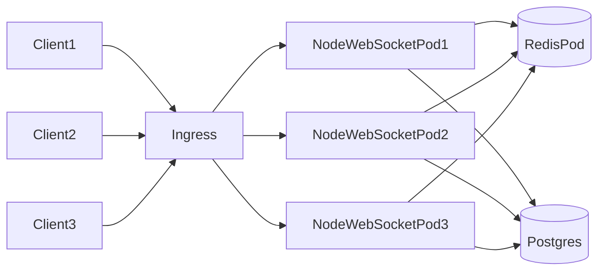
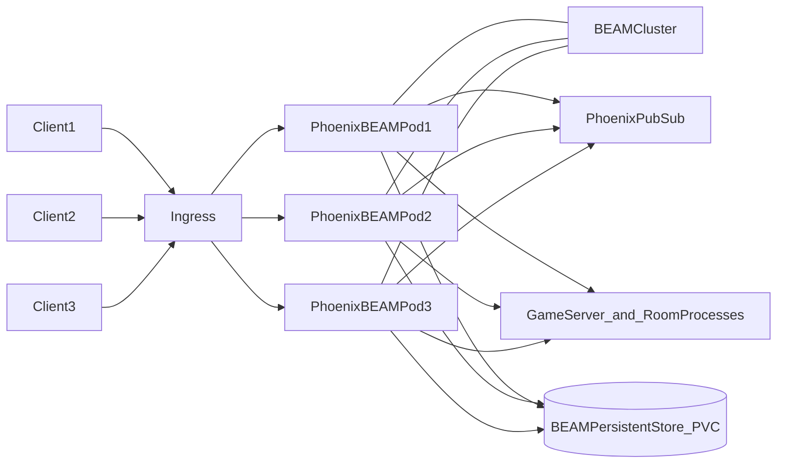
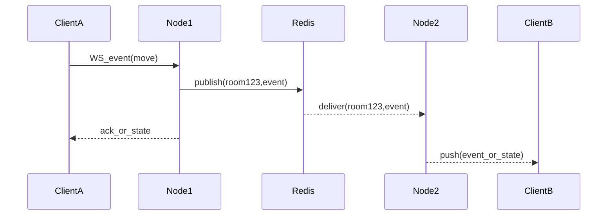
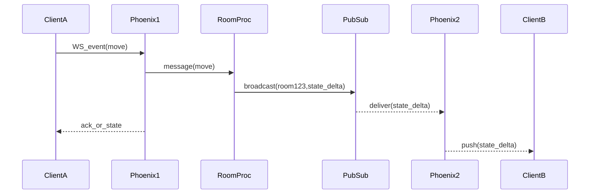

# Node.js + Postgres + Redis vs Elixir/BEAM (Phoenix): a realtime game backend comparison

This doc compares two common backend architectures for a realtime multiplayer game (like Swipefish), drawn as **Kubernetes pods**:

- **Node.js + Postgres + Redis** (Redis used for pub/sub/queues and/or authoritative shared game state)
- **Elixir/BEAM + Phoenix** (state in BEAM processes; “Elixir-native” persistence options instead of Postgres; Redis optional)

It focuses on how the **concurrency model**, **state placement**, and **scaling/failure modes** differ.

## Problem framing (what a realtime game backend needs)

- **Realtime fanout**: push updates to N clients fast (WebSocket).
- **High concurrency**: many concurrent connections + short bursts (round transitions, matchmaking).
- **Authoritative state**: consistent room/game state, including edge cases (disconnect/reconnect).
- **Durability**: store user/account data, game history, analytics, moderation signals.
- **Fault tolerance**: failures should be isolated; recovery should be predictable.
- **Operational simplicity**: observability, deploy/rollback, scaling, on-call ergonomics.

## Architecture A: Node.js + Postgres + Redis (pods)

This is a typical “web stack” that many teams start with.

### What usually lives where

- **Postgres**
  - durable entities: users, matches, purchases, game history, bans, audit logs
  - sometimes “source of truth” for state that must survive restarts
- **Redis** (common patterns; you said you’re thinking pub/sub + queues and/or game-state)
  - **Pub/Sub fanout** across Node instances (so instance A can notify clients connected to instance B)
  - **Queues** (background jobs, delayed tasks, match start timers, retries)
  - **Shared state** (presence, room membership, matchmaking queues, sometimes authoritative game state)
  - **Distributed locks** (rate limits, leader election, idempotency protection)
- **Node instances**
  - WebSocket connection handling, validation, business logic, API surface

### Concurrency model (Node)

- **Single-threaded event loop** per process. Concurrency is achieved by:
  - non-blocking I/O + async callbacks/promises
  - multiple Node processes/containers for CPU scaling
  - offloading CPU-heavy tasks to workers
- Failure mode: a CPU spike or blocking work can increase **tail latency** for many requests on that instance (the loop is shared).

### Scaling pattern

- Horizontal scale with more Node instances.
- For WebSockets:
  - you often use **sticky sessions** at L7 load balancer
  - cross-node messaging is typically Redis pub/sub, or a dedicated message bus
- Redis often becomes a central coordination point (good when managed well; risk when it becomes a “god service”).

### Strengths (Node + PG + Redis)

- **Ecosystem & hiring**: broad talent pool, libraries, integrations.
- **Straightforward mental model** for many teams (request/response + shared cache/queue).
- **Good fit** when the domain is mostly CRUD + moderate realtime.
- **Operational familiarity**: most platforms and tooling assume this shape.

### Tradeoffs / risks

- **State complexity**: once Redis holds authoritative room state, you must handle:
  - atomic updates, race conditions, idempotency, reconnect reconciliation
  - consistency vs performance (transactions/locks vs speed)
- **Redis as bottleneck**:
  - pub/sub fanout, hot keys, memory sizing, eviction behavior, cluster topology
- **Tail latency sensitivity** from event-loop stalls or GC pauses (mitigated by careful coding and scaling).
- **More moving parts**: app + DB + Redis + queue workers + (sometimes) a separate websocket layer.

## Architecture B: Elixir/BEAM + Phoenix

Elixir runs on the BEAM VM (Erlang). It’s designed around lightweight processes and fault-tolerant supervision.

### What usually lives where

- **BEAM processes (in-memory)**
  - authoritative state for “live” entities (rooms, matches, matchmaking)
  - each room/game often maps naturally to a process (or a small process tree)
  - message passing provides serialization without explicit locks (per process)
- **Phoenix**
  - WebSocket transport via **Phoenix Channels** or **LiveView**
  - PubSub used for fanout between processes (and between nodes once configured)
- **Elixir persistent storage (instead of Postgres)**
  - if you avoid Postgres, you need to decide what “persistence” means:
    - **Mnesia** (distributed Erlang DB): can replicate to multiple nodes; good for clustered state, but not a general replacement for relational queries.
    - **DETS** (disk-based term storage): simple local persistence; not distributed; usually paired with replication/snapshots.
    - **ETS + snapshots**: keep state in memory, periodically snapshot to disk/object storage.
  - The diagram shows this as `BEAMPersistentStore_PVC` (some BEAM-managed persistence backed by a Kubernetes volume).
- **Redis (optional)**
  - can still be used for queues/caching or cross-system integration, even in a BEAM-first design.

### Concurrency model (BEAM)

- BEAM runs **many lightweight processes**, each with its own mailbox.
- Processes are **isolated**: one process crashing doesn’t crash others.
- Scheduling is preemptive; long CPU work in one process doesn’t block all others the way a single event loop can (CPU contention still exists, but isolation is better).

### Scaling pattern

- Scale with more BEAM nodes.
- For realtime:
  - clients connect to any node
  - room/game processes often live on one node per room and communicate via message passing
  - to route an event to “the right room process” across nodes, you need a registry/routing strategy (that part is application design, not automatic)
  - PubSub/cluster messaging can distribute broadcasts/events across nodes once configured
- Clustering adds complexity (node discovery, cookies, ports, network policies). This repo already experiments with this via `dns_cluster` in `lib/cardtable/application.ex`.

### Strengths (Elixir/BEAM)

- **Excellent fit for highly concurrent realtime**: many connections, many “rooms”, rapid fanout.
- **Fault tolerance story is first-class**:
  - supervision trees restart failed processes in a controlled way
  - “let it crash” works because state can be owned by a process with clear recovery
- **Natural state modeling**:
  - per-game process = serialized event handling without external locks
- **Great introspection tooling** (Observer, tracing, process inspection) when distribution access is set up.

### Tradeoffs / risks

- **Smaller hiring pool** and less “default familiarity” for many teams.
- **Distributed BEAM complexity**:
  - node discovery, networking, release configuration, deployment patterns
  - you need to decide how to place/migrate room processes across nodes
- **Binary dependencies** can be trickier (NIFs), though many apps avoid them.
- **DB driver / ORM differences** (Ecto) may be a learning curve for Node teams.

## Realtime fanout: how messages typically flow

### Node + Redis pub/sub (typical)

Key point: cross-node fanout typically goes through Redis (or a message bus).

### BEAM processes + Phoenix PubSub (typical)

Key point: the “room” is often a process. Fanout is a broadcast to subscribers, potentially spanning nodes.

## Static assets and CDNs (common questions)

### Are static assets served by the webserver in both options?

Often yes, but there are two common patterns:

- **Serve from your web layer** (simple):
  - Phoenix: `Plug.Static` from `priv/static`
  - Node/Express: static middleware or a separate “frontend” web server container (common in k8s)
- **Serve from object storage + CDN** (typical at scale):
  - offloads bandwidth and caching from your app pods
  - enables long cache headers with content-hashed filenames

### Publishing to a CDN on DigitalOcean Kubernetes

DigitalOcean Kubernetes doesn’t automatically give you a CDN for your app assets; the common approach is:

- Put assets in **DigitalOcean Spaces** and enable the **Spaces CDN**
- Upload on CI/CD (e.g. `aws s3 sync` compatible API) to a bucket/prefix
- Configure your app to reference the CDN base URL for assets (frontend build-time, or Phoenix endpoint `static_url`/asset host if you go that route)

## Notes on the BEAM “no Postgres” choice

If you truly want to avoid Postgres, be explicit about what you’re persisting:

- **Authoritative live game state** (rooms, players, timers): BEAM processes + Mnesia/DETS can work.
- **User accounts, payments, history, analytics**: these are typically much easier in a relational DB; replacing this with “Elixir persistence” is possible but usually increases complexity.

## State placement: authoritative game state options

### Node stack common choices

- **In-memory per Node instance**
  - fastest
  - requires sticky sessions and careful reconnect logic
  - fails over poorly unless state is reconstructed
- **Redis as authoritative state**
  - enables stateless Node instances and non-sticky routing
  - requires careful atomic update patterns (Lua scripts / transactions / locks)
  - must plan for Redis outages/partitions
- **Postgres as authoritative state**
  - durable and consistent
  - often too slow/contended for high-frequency realtime state updates unless carefully designed

### BEAM common choices

- **Process-owned state (in-memory)**
  - clear single-writer semantics per process
  - recoverability depends on restart strategy and persistence snapshots
- **Hybrid**
  - process owns hot state; periodically snapshot to Postgres
  - use PubSub to keep clients updated

## Reliability & operability

### Node + Redis

- Reliability comes from:
  - app-level retries, circuit breakers, idempotency keys
  - Redis/queue durability configuration
  - horizontal scaling and load shedding
- Common operational hotspots:
  - Redis memory/eviction, hot keys, pub/sub backpressure
  - queue buildup and retry storms

### BEAM + Phoenix

- Reliability comes from:
  - supervision + process isolation
  - well-defined process ownership of state
- Common operational hotspots:
  - cluster formation issues (DNS, cookies, ports)
  - message storms if broadcast patterns aren’t bounded (need back-pressure discipline)

## Pros/cons summary

### Node.js + Postgres + Redis

- **Pros**
  - familiar stack; broad ecosystem
  - easy to staff; lots of reference architectures
  - Redis provides flexible primitives (pub/sub, queues, shared state)
- **Cons**
  - realtime + authoritative shared state pushes complexity into Redis semantics and app-level locking/idempotency
  - event-loop stalls/GC pauses can impact tail latency
  - more “coordination infrastructure” to run well at scale

### Elixir/BEAM + Phoenix

- **Pros**
  - strong match for realtime concurrency and long-lived connections
  - fault isolation and supervised recovery are core strengths
  - process-per-room is a natural modeling approach
- **Cons**
  - smaller ecosystem/hiring pool
  - distributed operations require intentional design (discovery, node naming, release config)
  - you still need a plan for persistence and cross-node process placement

## Decision guidance (rules of thumb)

### Choose Node + Postgres + Redis if…

- your team is already strong in Node and wants fastest iteration with familiar tooling
- the game is mostly CRUD + moderate realtime, or you’re comfortable centralizing coordination in Redis
- you want to rely on managed services for most infrastructure primitives (DB/Redis/queues)

### Choose Elixir/BEAM + Phoenix if…

- realtime concurrency is core (lots of rooms, lots of WebSockets, frequent fanout)
- you want a first-class fault tolerance model (supervision trees, crash isolation)
- you’re willing to invest in BEAM operational patterns (releases, clustering, observability)

## Hybrid option (very common when a Node app already exists)

- Keep **Node** for:
  - web frontend SSR / general API gateway / admin / payments integrations
- Add **BEAM service** for:
  - realtime game loop + room processes + WebSocket fanout
- Use Postgres for durable state and a message bus (or HTTP) between services.

This can reduce risk while still letting the realtime core use the BEAM model.

