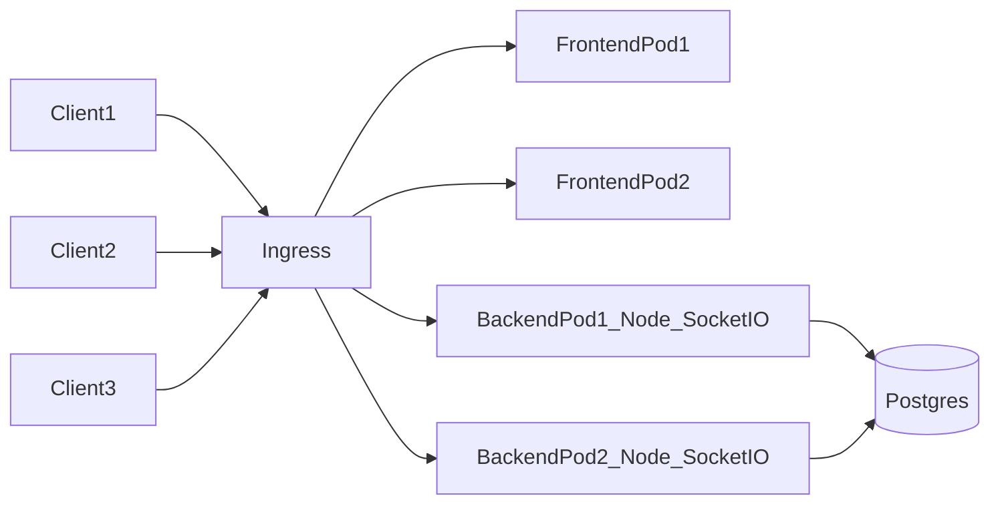
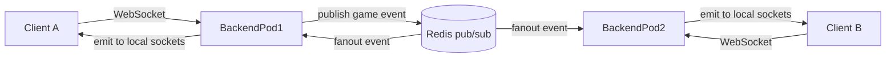

# Swipefish architecture (as implemented)

This repo runs Swipefish as a **Node.js + Socket.IO** backend with a **React/Vite** frontend on **DigitalOcean Kubernetes**, with PostgreSQL as the database. This doc summarizes the architecture as implemented in this repository.

## High-level view (pods)

Notes:
- In this repo, **frontend and backend are separate deployments**.
- The Ingress routes `/` to frontend and `/socket.io` to backend (see `k8s/ingress.yaml`).

## Realtime updates across multiple backend pods (Socket.IO)

Realtime updates are done via **Socket.IO room broadcasts** (e.g. `io.to(roomId).emit(...)` in `backend/src/rooms.ts`).

**Today:** the backend uses Socket.IO’s **default in-memory adapter**, so broadcasts only reach clients connected to the **same** backend pod. With multiple backend replicas (`k8s/backend-deployment.yaml`), two players in the same game can land on different pods and **miss each other’s updates**.

**Ingress sticky sessions** can keep *a given client* pinned to one pod, but NGINX Ingress can’t reliably route *all clients for a given game* to the same pod. The standard fix is a **cross-pod adapter**, typically Redis.

## Kubernetes resources in this repo

- **Ingress**:
  - `k8s/ingress.yaml` routes:
    - `/` → `Service/frontend:80`
    - `/socket.io` → `Service/backend:3000`
- **Frontend**:
  - `k8s/frontend-deployment.yaml` (nginx-style container on port 80)
- **Backend**:
  - `k8s/backend-deployment.yaml` (Node server on port 3000, metrics on 9464)
- **Database**:
  - Typical production guidance is **DigitalOcean Managed Postgres**
  - This repo also includes an optional in-cluster `StatefulSet`:
    - `k8s/postgres-statefulset.yaml`

## Static assets

In this repository’s k8s layout:
- The **frontend pod** serves the built React app (static assets) on port 80.
- The backend focuses on APIs / Socket.IO and does not need to serve frontend static assets.

That’s a common k8s split: “static web” and “realtime/api” are separate pods.

## Static assets + CDN on DigitalOcean Kubernetes

### Do we need a CDN if the frontend pod serves assets?

Not strictly. Serving assets from the frontend pod is fine at small scale.

A CDN helps when you want:
- reduced load on your cluster
- better global latency
- aggressive caching with content-hashed assets

### How to publish assets to a CDN on DigitalOcean

The common DigitalOcean path is:

1) Create a **DigitalOcean Spaces** bucket
2) Enable the **Spaces CDN** for that bucket
3) Upload build artifacts (CI/CD step), e.g.:
   - build frontend → `dist/` (your `frontend/Dockerfile` already builds to `dist` then copies into nginx)
   - sync to Spaces: `aws s3 sync dist s3://<space>/<prefix>/` using Spaces credentials/endpoint
4) Point your frontend build at the CDN base URL:
   - for Vite, set a base/public URL so generated asset URLs resolve to the CDN origin (this is a frontend build-time concern, not k8s)
5) Keep k8s serving your app, but let the CDN serve static files:
   - the Ingress continues routing `/` to `frontend` and `/socket.io` to `backend` (`k8s/ingress.yaml`)
   - the frontend HTML can reference CDN-hosted JS/CSS/images

This approach is independent of Kubernetes: k8s runs your app pods; Spaces+CDN serves static bytes.

## File index (where to look)

- `README.md`: top-level overview and current architecture description
- `k8s/ingress.yaml`: ingress routes (`/` frontend, `/socket.io` backend)
- `k8s/backend-deployment.yaml`: Node backend pods + env vars + probes
- `k8s/frontend-deployment.yaml`: frontend pods serving static assets
- `k8s/postgres-statefulset.yaml`: optional in-cluster Postgres
- `docs/DEPLOY_STEPS.md`: deployment walkthrough
- `docs/OBSERVABILITY_IMPLEMENTATION.md`: observability stack summary

